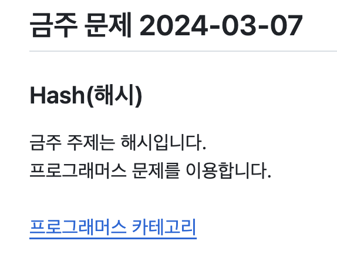

# Today Problem
[with-algorithm](https://github.com/kangjae4real/with-algorithm) [README.md](https://github.com/kangjae4real/with-algorithm/blob/master/README.md) 문서에 문제 내용을 추가해주는 스크립트입니다. <br />

## Requirements
- Node.js
- yarn

## Environment
`.env.example`을 참고하여 환경변수를 설정해주세요. <br />
환경변수가 없다면 Script가 동작하지 않습니다.

## Run
```shell
$ yarn
$ yarn start
```

## Result
